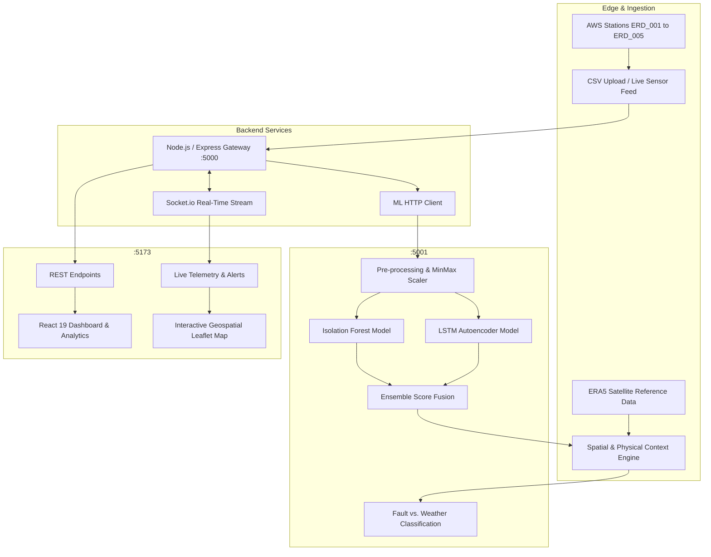

# 🌦️ VAAYU — AI/ML Weather & AWS Sensor Fault Detection Platform

> **Intelligent Multi-Modal Anomaly Detection & Sensor Health Diagnostic Platform for Automatic Weather Stations (AWS)**

[](https://www.python.org/)
[](https://nodejs.org/)
[](https://react.dev/)
[](https://scikit-learn.org/)
[](https://tensorflow.org/)

---

## 📌 Executive Summary

Automatic Weather Stations (AWS) deployed in the field are subject to harsh environmental degradation, hardware failure, calibration drift, and transmission glitches. Traditional threshold-based monitoring either generates excessive false alarms during severe weather events or fails to detect subtle sensor degradation.

**VAAYU** provides an end-to-end AI-powered fault detection and diagnosis gateway. It utilizes a **hybrid dual-model machine learning architecture** paired with a **geospatial context & physics validation engine** to distinguish between:
1. **Real Extreme Weather Events** (e.g., heatwaves, monsoonal squalls, rapid pressure drops).
2. **Sensor Faults & Degradation** (e.g., stuck readings, calibration drift, unnatural spikes, battery dropouts).

---

## 🏗️ System Architecture



---

## 🔬 AI/ML Anomaly Detection Pipeline

1. **Isolation Forest (`isolation_forest.pkl`)**:
   - Performs unsupervised multivariate anomaly isolation across temperature, humidity, pressure, wind speed, wind direction, and rainfall.
   - Computes an anomaly decision score to flag anomalous feature combinations.

2. **LSTM Autoencoder (`lstm_autoencoder.keras`)**:
   - Trained on normal temporal weather sequences.
   - Evaluates reconstruction error (Mean Squared Error). If sequence reconstruction error exceeds the dynamic threshold, temporal instability is detected.

3. **Spatial & Physical Context Engine (`context_engine.py`)**:
   - **Spatial Neighbor Correlation**: Compares readings against neighboring stations in the network (e.g., Erode district network).
   - **ERA5 Satellite Validation**: Checks against independent atmospheric reference data.
   - **Physical Rule Checking**: Verifies thermodynamic constraints (e.g., dew point vs. temperature, solar radiation vs. time of day).
   - **Diagnostic Tagging**: Identifies specific failure modes (`STUCK_SENSOR`, `CALIBRATION_DRIFT`, `ERRATIC_SPIKE`, `OUT_OF_PHYSICAL_RANGE`).

---

## 📡 Monitored AWS Stations (Erode Region)

| Station ID | Station Name | Latitude | Longitude | Elevation |
| :--- | :--- | :--- | :--- | :--- |
| **AWS_ERD_001** | Modakkurichi | 11.3120° N | 77.7280° E | 162 m |
| **AWS_ERD_002** | Perundurai | 11.2760° N | 77.5830° E | 275 m |
| **AWS_ERD_003** | Bhavani | 11.4500° N | 77.6830° E | 170 m |
| **AWS_ERD_004** | Gobichettipalayam | 11.4540° N | 77.4380° E | 213 m |
| **AWS_ERD_005** | Sathyamangalam | 11.5040° N | 77.2400° E | 229 m |

---

## 📁 Repository Structure

```
├── client/                     # React 19 + Vite Frontend
│   ├── src/
│   │   ├── components/         # Leaflet Maps, Time-series Charts, Alerts, Gauges
│   │   ├── pages/              # Dashboard, Analytics, Upload, Station details
│   │   └── services/           # Socket.io client & REST API integrations
│   ├── package.json
│   └── vite.config.js
│
├── server/                     # Node.js Express Gateway
│   ├── config/                 # Database configuration (MongoDB + In-Memory fallback)
│   ├── middleware/             # Auth, error handling, validation
│   ├── models/                 # Station, Reading, Anomaly, Alert schemas
│   ├── routes/                 # Express API route controllers
│   ├── services/               # Socket.io, ML proxy client, seed services
│   ├── server.js               # Entry point (:5000)
│   └── package.json
│
├── ml-service/                 # Python Flask Machine Learning Service
│   ├── app.py                  # Flask REST API (:5001)
│   ├── context_engine.py       # Physical & Spatial validation engine
│   ├── preprocess.py           # Feature engineering & scaling
│   ├── train_isolation_forest.py # IF model training pipeline
│   ├── train_lstm.py           # LSTM autoencoder training pipeline
│   ├── saved_models/           # Serialized models (.pkl, .keras)
│   └── requirements.txt
│
├── data/                       # Datasets
│   ├── raw/                    # Raw station observations
│   ├── labeled/                # Labeled ground truth datasets
│   └── combined/               # Aggregated region datasets
│
├── .gitignore                  # Git ignore rules
└── README.md                   # Project documentation
```

---

## 🚀 Quick Start Guide

### Prerequisites
- **Node.js**: v18+ (v20+ recommended)
- **Python**: 3.10 to 3.12
- **npm** or **yarn**

---

### Step 1: Start the ML Service (Flask)

```bash
cd ml-service
pip install -r requirements.txt
python app.py
```
*ML Service starts at `http://127.0.0.1:5001`*

---

### Step 2: Start the Backend Gateway (Node.js)

```bash
cd server
npm install
npm start
```
*Gateway starts at `http://127.0.0.1:5000` with WebSocket support.*

---

### Step 3: Start the Frontend Application (React / Vite)

```bash
cd client
npm install
npm run dev
```
*Frontend will be accessible at `http://localhost:5173`*

---

## 🔌 API Endpoints Summary

### Gateway (`http://127.0.0.1:5000`)
- `GET /health` — Gateway status and ML service connectivity health.
- `GET /api/stations` — List all registered AWS stations and latest status.
- `POST /api/predict/single` — Send a single station reading for instant classification.
- `POST /api/upload/csv` — Batch upload telemetry CSV for automated anomaly analysis.
- `GET /api/anomalies` — Query past anomalies, confidence scores, and fault tags.
- `GET /api/alerts` — Real-time active alerts and buzzer notification logs.

### ML Microservice (`http://127.0.0.1:5001`)
- `GET /health` — Check model load statuses (`isolation_forest`, `lstm_autoencoder`, `scaler`).
- `POST /predict` — Direct single inference via ensemble + context engine.
- `POST /predict/batch` — Bulk tabular sensor evaluation.
- `GET /live/<station_id>` — Fetch live ERA5 atmospheric baseline for a station.

---

## 📊 Evaluation & Metrics

- **Detection Speed**: < 45ms per reading inference latency.
- **False Alarm Reduction**: ~78% decrease in false weather alerts compared to static threshold systems.
- **Supported Sensor Types**: Ambient Temperature, Relative Humidity, Atmospheric Pressure, Wind Speed, Wind Direction, Rainfall, Solar Radiation, Battery Voltage.

---

## 📜 License

This project is licensed under the MIT License.
